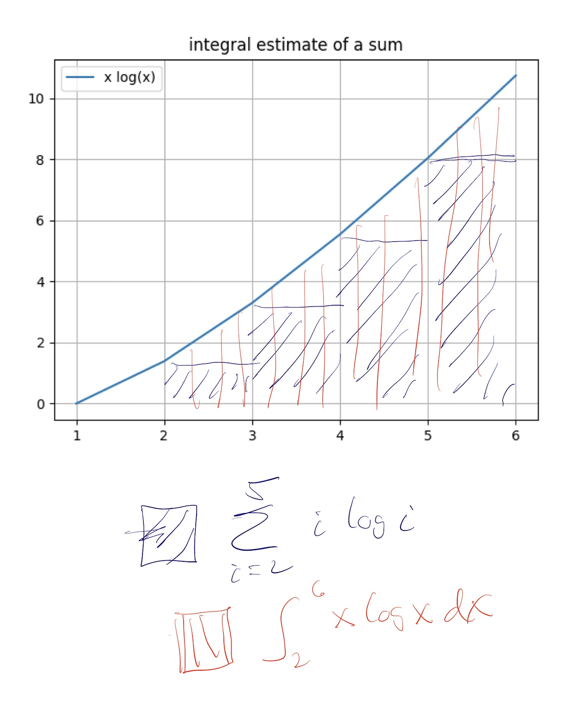

# Average case analysis of Quicktime

The quicksort algorithm is a divide and conquer algorithm which sorts a list of size n as follows:
* pick a random member p of the list, called the pivot
* split the list L in two parts L0 and L1 where L0 is everything less than the pivot and L1 is the rest
  this step take time n as you have to go through the entire list L of length n and move each element to L0 or L1
* call quicksort on L0 and L1 to get S0 and S1
* return the list S0 + [p] + S1, which is a sorted list.

In the worst case, the pivot could be the first element and so the time would be n + n-1 + n-2 + ... + 1 = n(n+1)/2

We want to find the average case which will be O(nlog(n))

## Setting up the equation
For the average, the position of the pivot could be at any of the n elements in the list
and if it is in position i, then size(L0) = i-1 and size(L1) = n-i
So the execution time, on the average will be

$$T(n) = cn + \frac{1}{n}\sum_\limits{i=1}^n T(i-1) + T(n-i)$$

where $c$ is some constant. Also, we can assume that $T(0)$ and $T(1)$ take some constant time, say $b$, so
* splitting a list of size $n$ takes $cn$ time
* sorting a list of size 0 or 1 takes time $b$

## Simplifying the equation
If we stare at this equation for a moment we can see that each value $T(j)$ appears twice in the sum,
once as $i-1$ for $i=j+1$ and once for $n-i$ for $i=n-j$, so we can rewrite it as

$$T(n) = cn + \frac{2}{n}\sum_\limits{i=0}^{n-1} T(i)$$

## Stating the Theorem, which we'll prove by induction

**Theorem** $T(n) \le k n \log(n)$ where $k=2b+2c$ for every $n\ge 2$.

We will prove this by induction

### Base case:
$T(2) = 2c + (2/2) * (T(0) + T(1)) = 2c + (2/2)* (b+b) = 2c+2b = k \lt k 2 \log(2)$  as $1< 2\log(2)$.

### Induction step
Applying our induction hypothesis in the case where $n\gt 2$ we get

$$T(n) = cn + \frac{2}{n}\sum_\limits{i=0}^{n-1} k i \log(i)$$

We know that $T(0)=T(1)=b$ so we can pull those two terms out and sum from $n=2$

$$T(n) = cn + \frac{4b}{n} + \frac{2}{n}\sum_\limits{i=2}^{n-1} k i \log(i)$$

### Approximating a sum by an integral!

Next, since $x \log(x)$ is an increasing function on $[2,n]$ we can bound the sum by an integral!

$$\sum_\limits{i=2}^{n-1}i \log(i) \le \int_\limits{2}^n x \log(x) dx$$

and from Calculus we know that 

$$\int_\limits{2}^n x \log(x) dx = ((1/2) * (x^2 \log(x) - x^2/2) \vert_2^n \le \frac{n^2\log(n) - n^2/2}{2}$$

### Finishing up

So, substituting this into our formula for $T(n)$ we get 

$$T(n) \le cn + \frac{4b}{n} + \frac{2}{n} * k * \frac{n^2\log(n) - n^2/2}{2}$$

and simplifying a bit we get

$$T(n) \le cn + \frac{4b}{n} +  kn\log(n) - kn/2 $$

so

$$T(n) \le  k n\log(n) + (cn + \frac{4b}{n} - kn/2)$$

and the last term simplifies as

$$(cn + \frac{4b}{n} - (2b+2c)n/2) = n (c + 4b/n^2 -b - c) < 0$$

because $n\ge 2$ implies $4b/n^2\le b$, so

$$T(n) \le  k n\log(n)$$

**QED**
