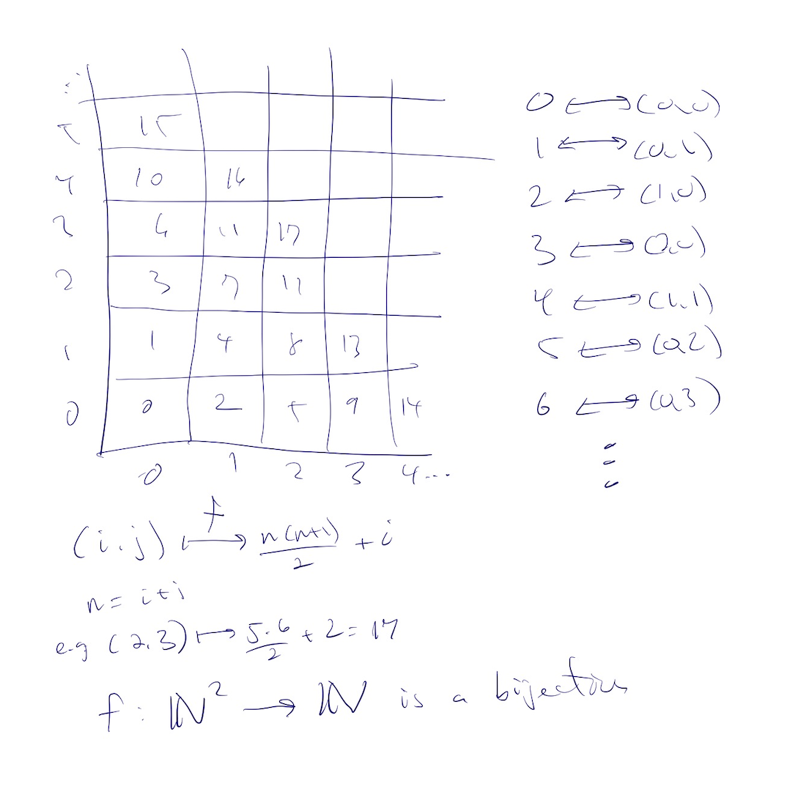

# Countable Sets
We say that a set $S$ is countable if there is a surjective function $f$ from $\mathbb{N}$ to $S$.

If a set is countable, then the sequence

$(f(0), f(1), f(2), \ldots )$

can be thought of as counting the elements of $S$ and each element $s$ of $S$ will appear as $f(n)$ for some $n$
because $f$ is surjective.  Some elements of $s$ might appear multiple times unless the function is also injective.
You can try to prove that if there is a surjective $f$ then we can always find a bijective function from $\mathbb{N}$ to $S$.

Let's look at some examples:
* the positive even numbers are countable (let $f(x) = 2x+2$)
* the positive odd numbers are countable (let $f(x) = 2x+1$)
* the positive prime numbers are countable (let $f(n)$ be the nth prime number)

What about other sets like the integers, pairs of integers, the rationals, the reals, the powerset of the integers, functions from integers to integers, etc.
We'll answer those questions next, and the first two are countable, the last three are not!

**Proposition.** If S and T are countable sets, then so is $S\cup T$.

**Proof:** let $f$ and $g$ be the counting functions for S and T respectively.
Define h as follows:
* h(2n) = f(n)
* h(2n+1) = g(n)

Then h is surjective onto $S\cup T$.
**QED**

**Corollary.** The integers $\mathbb{Z}$ are countable.

**Proof:** It is easy to show that the negative integers, $\mathbb{Z}^-$ are countable,
and $\mathbb{Z} = \mathbb{N} \cup \mathbb{Z}^-$ is the union of two countable sets
and so is countable. **QED.**

**Proposition:** $\mathbb{N}^2$ is a countable set.

**Proof:** To prove this we will define a bijection from $\mathbb{N}^2$ to $\mathbb{N}$
We can visualize $\mathbb{N}^2$ as a rectangular grid 
and we can number the pairs (i,j) starting at (0,0) and the numbering each diagonal from top to bottom
as shown in the following image:

This shows that the function $f:\mathbb{N}^2\rightarrow\mathbb{N}$ defined by
* $f((i,j) = n(n+1)/2+i$  where $n=i+j)$

is a bijection and hence we have a surjective (actually bijective) map from $\mathbb{N}$ to $\mathbb{N}^2$.
Since it is a bijection, there is an inverse map $G$ which maps $\mathbb{N}$ onto $\mathbb{N}^2$
where 
* $G(0)=(0,0)$
* $G(1)=(1,0)$
* $G(2)=(0,1)$
* $G(3)=(2,0)$
* $G(4)=(1,1)$
* $\ldots$

**QED**
  
**Proposition:** If $S_0,S_1,\ldots$ is a countable sequence of countable sets, then their union

$S = \bigcup_\limits{i=0}^\infty S_{i}$

is a countable set.

**Proof**
We know we have a bijective map $G:\mathbb{N}\twoheadrightarrow\mathbb{N}^2$,
and if we let $f_i:\mathbb{N}\twoheadrightarrow S_i$ be a surjective map counting the 
elements of $S_i$, then we can define
* $h(i,j) = f_i(j)$
so $h:\mathbb{N}^2 \twoheadrightarrow S$

and so $h\circ G$ maps $\mathbb{N}$  to $\mathbb{N}^2$ to $S$ is surjective, so $S$ is countable.
**QED**

But what about the rational numbers?

**Theorem**. The rational numbers $\mathbb{Q}$ form a countable set.

**Proof.**
Define $h(i,j) = i/j$ if $j\ne 0$ and $h(i,j) = 0$ if $j=0$, then $h$ is a surjective map
from $\mathbb{N}^2$ onto the rationals $\mathbb{Q}$.
So if we let $G:\mathbb{N}\rightarrow \mathbb{N}^2$ be the surjectifve map defined above,
then $h\circ G$ is a surjective map from $\mathbb{N}$ onto $\mathbb{Q}$.
**QED**

---

So we have seen that several big infinite sets are countable, but not all sets are countable.
We'll now look at two uncountable sets. First lets show that there are no surjections from a set to its powerset.

**Theorem**. For any non-empty set $S$, there does not exists a surjection from $S$ to its power set.

**Proof.**
We will prove this by contradiction. Suppose it is false.
Then there is a surjective function $f$ which takes elements $a\in A$ to subsets $S_a$ of $A$.
That is

$f(a) = S_a$

where $a\in A$ and $S_a\subseteq A$.

Let us define T to be the set of all elements $a$ such that $S_a$ does not contain $a$:

$T = \\{a \in A | \  a \not\in S_a\\}$

Since $f$ is surjective, there must be some element $b\in A$ with $T = S_b$.

There are two cases and we will show both lead to a contradiction, hence showing that
$f$ can not be surjective.

case 1: $b \in T$.  In this case, by the definition of $T$ we know $b\not\in S_b$. But $S_b$ was chosen to be equal to $T$.
So $b \not \in T$, which is a contradiction.

case 2: $b\not\in T$. In this case, since $T=S_b$ we known that $b \not\in S_b$, so by the definition of $T$, $b\in T$,
and this is also a contradiction.

Both cases lead to a contradiction, so there can be no such surjective function $f$. **QED**

---

**Corollary.** The power set of $\mathbb{N}$ is not countable!

**Proof:** By the Theorem there is no surjection from $\mathbb{N}$ to its powerset ${\cal P}(\mathbb{N})$
so ${\cal P}(\mathbb{N})$ is not countable, by definition. **QED**

**Theorem** The set of real numbers in the interval $I=[0,1]$ is not a countable set.

**Proof:** We will prove this by contradiction.  Suppose it is not true. Then there is a surjection
$f:\mathbb{N}\twoheadrightarrow I$ which maps each natural number $n$ to a real number in the interval
$[0,1]$. Let
* $f(n) = 0.b_{n1} b_{n2} b_{n3}\ldots$
 
be the binary representation of that real number $n$.  We can now construct a new real number $t$ defined
by 
$t=0.t_1 t_2 t_3\ldots$

where $t_i = 1 - b_{ii}$ so $t_i$ differs from $f(i)$ in the $i$ th place, but if $f$ was surjective
then $t=f(m)$ for some $m$ and this is a contradiction as $t$ has a different bit from $f(m)$ at the $m$ th place. Here is an image which shows how to construct $t$.

**QED**

